## Hi there 👋
### My name is Scott 🙋

 

#### A bit about me.

 
<td>
 <thead>

  
 </thead>
</td>
 

###### I been a developer on Linux since 2017 _

 

> Enjoying developing creating software and hardware that has security mechanisms, also helping people with their tech problems

 

###### Have been working on projects since 2011 _

 

> I enjoy and successful on making Circuits, Building with Raw Materials to build Smart Homes from scratch, building alarm system, Built many types of sensors.

 

**CyberCrime-Stoppers/CyberCrime-Stoppers** is a ✨ _special_ ✨ place for linux and the future goal for GNU and linux App, Tools, Drivers & Utilities, and working on things that matter for the OpenSource Communities and around the world that needs a clean and usable tools for Linux that we will most likely rely on in near future. with these times of need.

- 🔭 I’m currently working on ... ( Apps )Currently.
<!--- 🌱 I’m currently learning ... ways to bettering linux. --->
- 👯 I’m looking to collaborate on ... Anything Linux Related.
- 🤔 I’m looking for help with ... anything, ideas & what the linux community needs.
<!--- 💬 Ask me about ... --->
- 📫 How to reach me: ... by Email: give-me-ideas@mailservices2.simplelogin.com
<!--- 😄 Pronouns: ... --->
<!--- ⚡ Fun fact: ... --->

	###Follow me on other Platform Servers
	   
	- My OpenDesktop, HomePage
	     
	     https://www.opendesktop.org/u/CyberCrime-Stoppers

	- My OpenDesktop Profile Products - Proton Drive Utility App, Official .Deb Release.
	
	     https://www.opendesktop.org/p/2372306
 __________________________________________________________________________________
 
### Always thinking Security & Privacy
- I always develop and think up new ways to improve security mechanisms and enhance the nature of the technology we all share as a society.
- Fighting for the rights and freedom that come with the digital world: let's fight for the right to own our shit.

### Future Goals for GNU/Linux. [Linux has Potential].
- We are realizing globally that Linux offers superior privacy and freedom. Having an operating system we can truly rely on is a benefit for everyone.
  The old society clings to outdated ways of thinking that are no longer relevant. True happiness comes from having no control imposed upon us,
  and we can shift this mindset for the next generation

### Dangers on Megacorps & Big Tech
- Having the ability to do what we want on the technology we paid for was never supposed to be controlled by megacorps or evil corporations that dictate what
  we do on our machines. It’s uncivilized and malicious. Technology should not control people or make them addicted to their devices; rather, it is supposed to serve a purpose. 
  People who use technology should have the freedom to decide how and when to use their devices—and when to disconnect

### We are Building new Hardware
- Not explaining much about the hardware that is currently being developed, but it will help change & rewrite the security of the technology we all use today.
- Will be a great things to come with that piece of tech.
- 
 __________________________________________________________________________________
 
  <strong> The Goals Listed below 👇 </strong>  
- [✔️] Supporting & Bettering Linux. 
- [✔️] Protecting the Digital Freedom and Rights. 
- [✔️] Protecting the Privacy of our right as human. 
- [✔️] Everyone has the right to have free speech. 
- [✔️] Moving away from Microsoft/Windows into Linux - [as a choice]. 
- [✔️] New Encryption technolgoy for digital world - Quantum Encryption/Cryptographic Technology. 
- [✔️] Developing New hardware and Software - to Harden Security, AI, Quantum Computing, [New Gen DDoS], etc. 
- [✔️] Developing more support for Software and hardware for GNU/Linux. 
- [✔️] Developing more Driver support for newer and hardware that is current not supported.

 
 
  
- This will increase the GNU/Linux market share. The goal has always been Linux, given that it runs 90% of the world's infrastructure, powers the Internet, smart devices, and the IoT (Internet of Things). Without a doubt, we need more options for people around the world regarding software and drivers if we are to properly utilize Linux.

 __________________________________________________________________________________

### ALL Repositories on the CyberCrime-Stoppers GitHub Page. 
		> 🟥 PINK  - Proton AG Accounts & Services (Apps & Utilities). 
		> 🟩 GREEN - Lighter Green Linux Kernal (Forked) Darker Green Linux New(er) (Apps, Tools, Drivers & Utilities). 
		> 🟨 YELLOW - Firewall & Anti-Virus (Apps, Utilities & Services) 
		> 🟧 ORANGE - Linux User Protection Authentication System - built right into TPM1.2 + TPM2.0 (Systemd Level)
		> 🟦 BLUE - Servers, Networking, Internet & DNS, (Apps, Tools & Utilities)
		
		> 🟥 PINK  - Created by C.C.S Total  ( 1 )
		> 🟩 GREEN - Created by C.C.S Total  ( 4 )
		> 🟨 YELLOW - Created by C.C.S Total ( 2 )
		> 🟧 ORANGE - Created by C.C.S Total ( 1 )
		> 🟦 BLUE - Creayed by C.C.S Total   ( 1 )
		
		- Offical Releases & Usable Apps By C.C.S Total ( 1 ) [PDUA]
		- Created Linux Apps By C.C.S Grand Total ( 9 )
		
		Owner Username _ Acronym
			C.C.S = CyberCrime-Stoppers - [The Username & the owner of the GitHub Page]
		
		Apps _ Acronym
			> PDUA = Proton Drive Utility App
			> LCP = Linux Control Panel
			> LTPS = Linux 3D Printing System
			> LASUI = Linux Advanced Security User Interface
			> ALF = Linux Advanced Firewall
			> LINUPA = Linux User Pin Athenticator	
			> UBDNS = uBlockDNS Configuration GUI
			> LOW = List of Websites
		

<td>
 <thead>
<!--- 1   --->
<a href="https://github.com/CyberCrime-Stoppers/Proton-Drive-Utilities">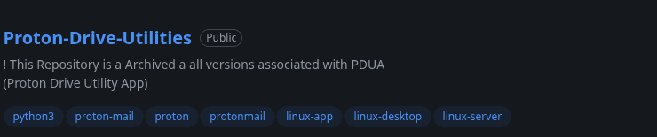</a>
<!--- 2   --->
<a href="https://github.com/CyberCrime-Stoppers/Proton-Drive-Utility-App">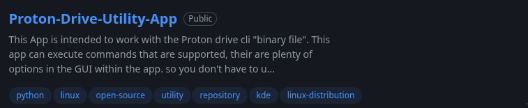</a>
<!--- 4  --->
<a href="https://github.com/CyberCrime-Stoppers/ccs-linux">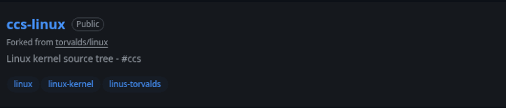</a>
<!--- 3   --->
<a href="https://github.com/CyberCrime-Stoppers/icond">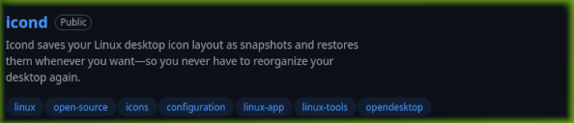</a>
<!--- 8  --->
<a href="https://github.com/CyberCrime-Stoppers/Linux-3D-Printing-System">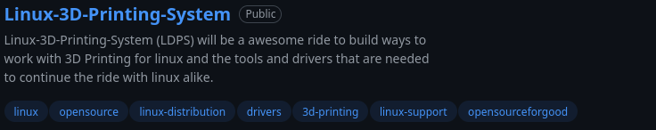</a>
<!--- 12  --->
<a href="https://github.com/CyberCrime-Stoppers/Linux-Control-Panel">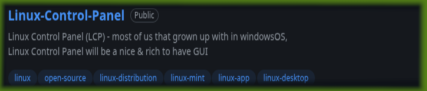</a>
<!--- 11  --->
<a href="https://github.com/CyberCrime-Stoppers/Linux-Advanced-Security-User-Interface">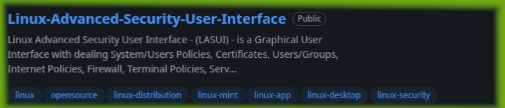</a>
<!--- 5  --->
<a href="https://github.com/CyberCrime-Stoppers/ccs-echo">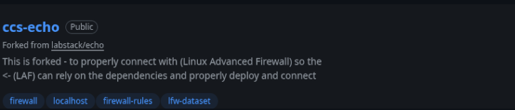</a>
<!--- 9 --->
<a href="https://github.com/CyberCrime-Stoppers/alf-nftables">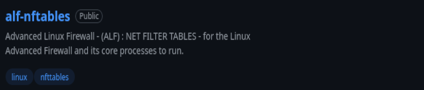</a>
<!--- 10  --->
<a href="https://github.com/CyberCrime-Stoppers/ccs-nftables">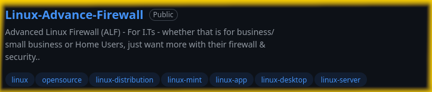</a>
<!--- 7  --->
<a href="https://github.com/CyberCrime-Stoppers/LINUPA_Linux_User_Pin_Authenticator">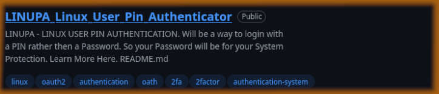</a>
<!--- 6  --->
<a href="https://github.com/CyberCrime-Stoppers/uBlockDNS-LinuxGUI-Configuration">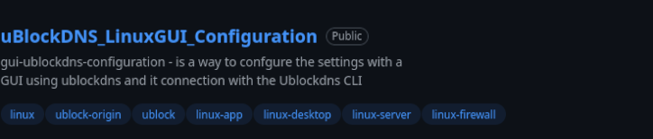</a>

  
 </thead>
</td>
